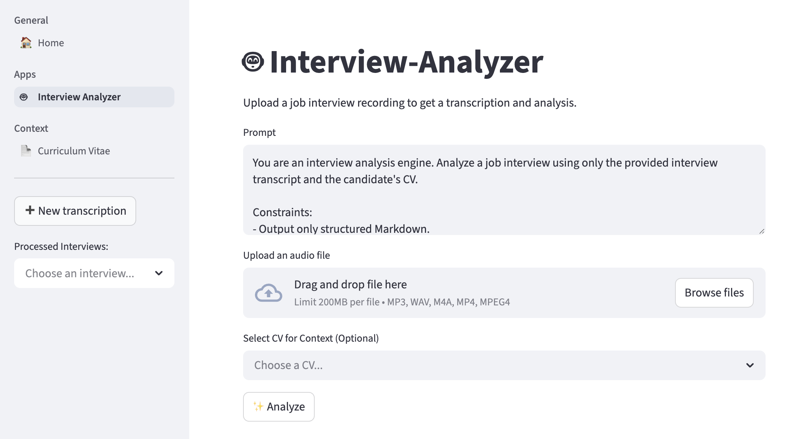

# Interview-Analyzer


Interview-Analyzer is a tiny application designed to help you analyze and improve your job interview performance. It leverages AI to transcribe and analyze your interview recordings, providing actionable feedback.



## Features

- **AI-Powered Analysis**: Automatically evaluates your interview performance using GPT-4o via LangChain.
- **Transcription**: Seamlessly converts audio recordings into text using OpenAI Whisper.
- **CV Management**: Upload and manage CVs (PDF) with automatic text extraction for cross-referencing during analysis.
- **Historical Analysis**: Keeps a record of your past interviews and analyses for tracking progress.
- **Re-analyze**: Re-analyze interviews with different prompts or updated CVs.
- **Secure Access**: Username/password authentication with Redis-backed rate limiting.

## Tech Stack

- **[Streamlit](https://streamlit.io/)**: Interactive web interface.
- **[Django ORM](https://www.djangoproject.com/)**: Database models and data access layer.
- **[LangChain](https://www.langchain.com/)**: LLM orchestration and analysis logic.
- **[PostgreSQL](https://www.postgresql.org/)**: Persistent storage of transcripts, analyses, and CVs.
- **[Redis](https://redis.io/)**: Cache and authentication rate limiting.
- **[Docker](https://www.docker.com/)**: Consistent environment and easy deployment.
- **[Poetry](https://python-poetry.org/)**: Dependency management.
- **[Ruff](https://docs.astral.sh/ruff/)**: Linting and formatting.

## Getting Started

### Prerequisites

- [Docker](https://docs.docker.com/get-docker/) and [Docker Compose](https://docs.docker.com/compose/install/) installed on your machine.
- An OpenAI API Key.

### Installation

1. **Clone the repository:**

   ```bash
   git clone <repository_url>
   cd interview-analyzer
   ```

2. **Configure environment variables:**

   ```bash
   cp .env.dist .env
   ```

   Open `.env` and fill in the required values:
   - `OPENAI_API_KEY`: Your OpenAI API key.
   - `LOGIN_USER`, `LOGIN_PASSWORD`: Credentials to log in to the app (defaults: `admin` / `admin`).

3. **Build and install:**

   ```bash
   make install
   ```

4. **Start the application:**

   ```bash
   make start
   ```

Run `make help` to see all available commands.

## Usage

1. Open your browser and navigate to `http://localhost:8501`.
2. Log in using the credentials defined in `.env`.
3. **Analyze New Interview**: Go to the Interview Analyzer page, upload an audio file (MP3, WAV, M4A, MP4), optionally attach a CV, and click Analyze. The system will transcribe and analyze it with step-by-step progress.
4. **View History**: Use the sidebar to browse past interviews and review the AI's feedback.
5. **Manage CVs**: Go to the Curriculum Vitae page to upload, view, edit, or delete CVs.

## Database Management

The project includes **Adminer** for easy database management.

- Access Adminer at `http://localhost:8080`.
- System: PostgreSQL.
- Server: `db`.
- Username/Password/Database: As defined in your `.env` file.
